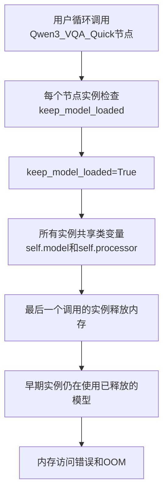
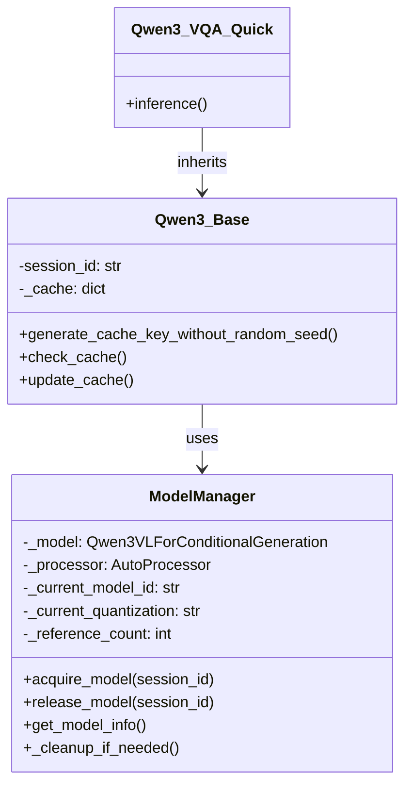
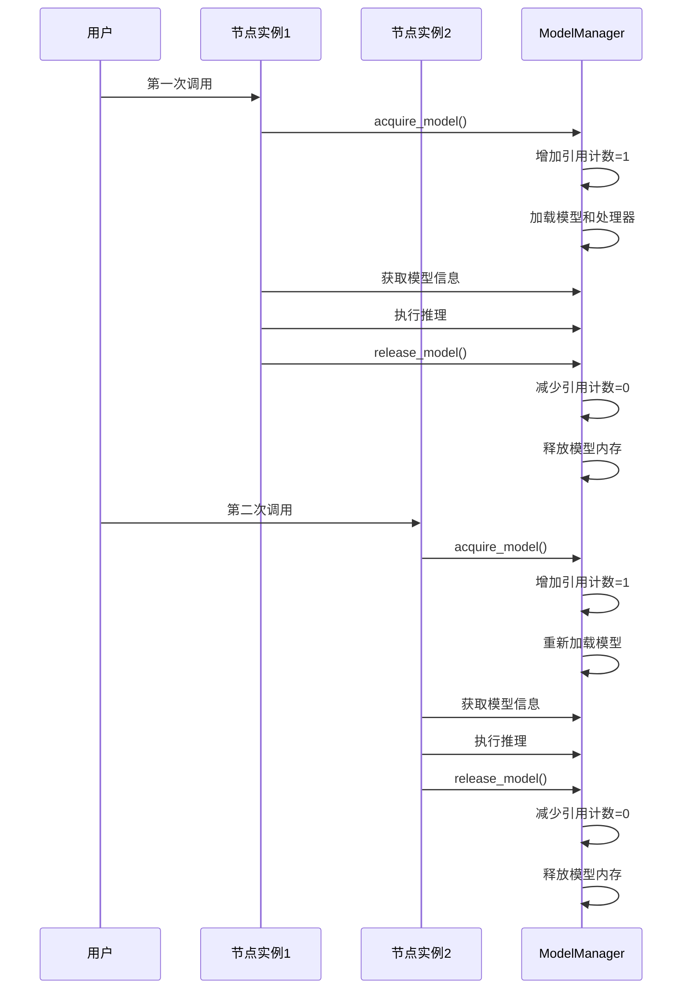
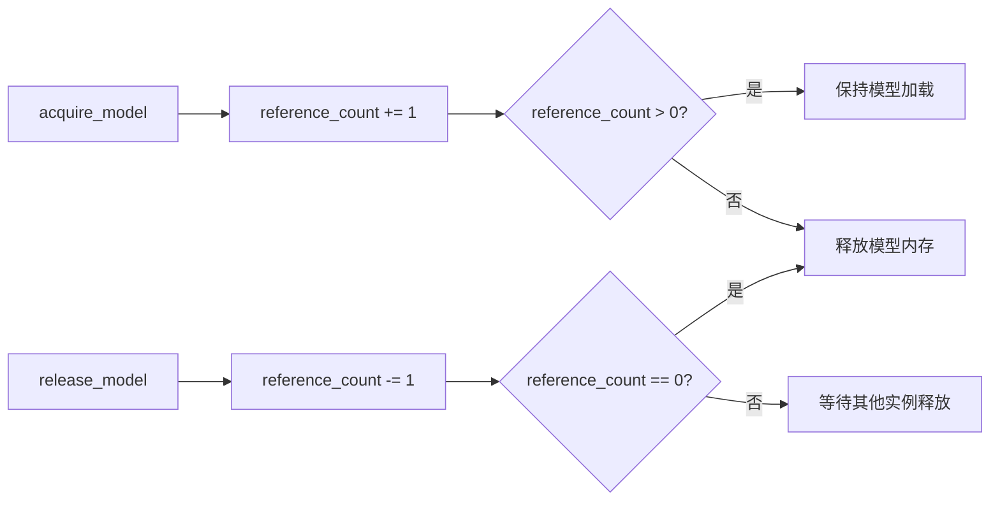
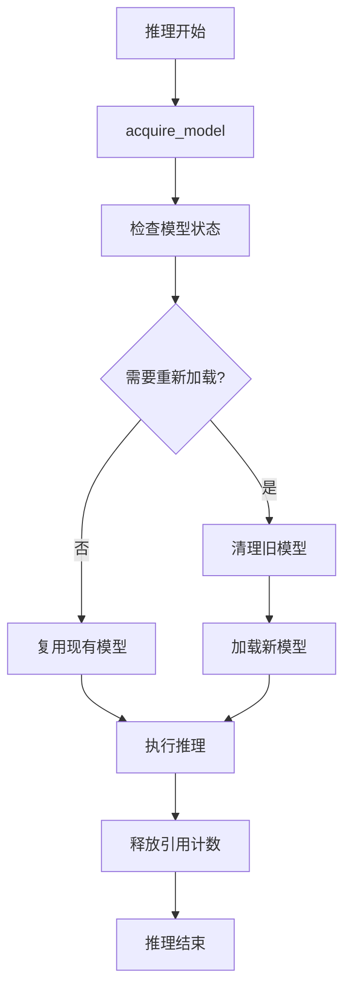

# Qwen3_VQA_Quick节点内存溢出修复方案

## 问题分析

### 原始设计问题


### 根本原因
1. **类级别共享与实例级别控制的冲突**
2. **循环调用时内存释放影响其他节点** 
3. **内存碎片化**

## 修复方案

### 新的设计架构


### 修复后的工作流程


## 关键改进点

### 1. 引用计数机制


### 2. 会话隔离
- 每个节点实例有唯一的session_id
- 避免实例间的相互影响
- 支持并发调用

### 3. 内存管理优化


## 预期效果

### 性能提升
1. **消除OOM**：引用计数确保模型只在真正无人使用时才释放
2. **减少重复加载**：相同配置的请求可以复用已加载的模型
3. **提高并发性能**：支持多个节点实例同时工作

### 内存使用优化
- **智能缓存**：只有在引用计数为0时才清理内存
- **按需加载**：每个请求都会正确管理模型生命周期
- **避免内存泄漏**：确保所有资源都能正确释放

## 测试建议

### 循环调用测试
```python
# 测试场景：连续调用10次Qwen3_VQA_Quick节点
for i in range(10):
    result = qwen_node.inference(
        prompt_template="test.txt",
        model="Huihui-Qwen3-VL-8B-Instruct-abliterated",
        keep_model_loaded=True,
        # ... 其他参数
    )
    print(f"第{i+1}次调用完成")
```

### 预期结果
- 内存使用稳定，不会持续增长
- 只有第一次和最后一次调用会重新加载模型
- 中间的调用可以复用已加载的模型