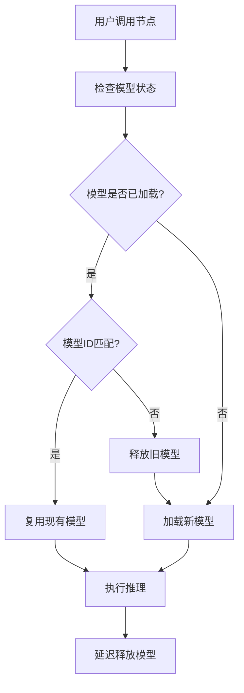
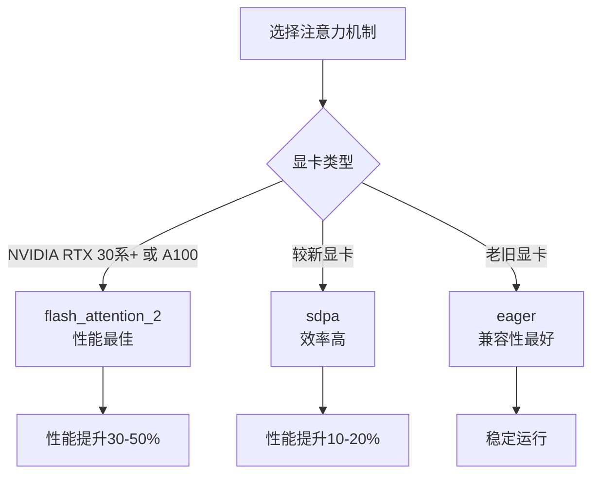

# ComfyUI Qwen3-VL-Instruct 节点性能优化说明

## 概述

本文档详细介绍了 ComfyUI Qwen3-VL-Instruct 自定义节点的性能优化功能，包括**Qwen3_VQA**和**Qwen3_VQA_Quick**两个节点的完整优化，包括智能模型复用系统、性能模式配置、注意力机制优化和量化支持等核心特性。

## 核心优化功能

### 1. 智能模型复用系统

#### 问题背景
- 原始设计中，每次调用都会重新加载模型，导致大量重复加载时间
- 循环调用时内存管理不当，容易出现OOM错误

#### 解决方案


#### 使用方法
1. **启用模型复用**：设置 `keep_model_loaded=True`
2. **检查日志**：观察日志中的模型复用信息
3. **性能监控**：关注模型加载时间和推理时间

### 2. 性能模式系统

#### 模式对比表
| 模式 | 推理速度 | 生成质量 | 内存使用 | 适用场景 |
|------|----------|----------|----------|----------|
| **speed** | ⭐⭐⭐⭐⭐ | ⭐⭐⭐ | ⭐⭐⭐⭐⭐ | 快速测试、批量处理 |
| **balanced** | ⭐⭐⭐ | ⭐⭐⭐⭐ | ⭐⭐⭐⭐ | 日常使用、平衡需求 |
| **quality** | ⭐⭐ | ⭐⭐⭐⭐⭐ | ⭐⭐⭐ | 高质量生成、最终输出 |

#### 模式详细说明

##### Speed 模式（速度优先）
- **推理参数优化**：
  - 限制 `max_new_tokens ≤ 1024`
  - 降低 `top_p = 0.8`
  - 降低 `top_k = 30`
- **性能提升**：相比balanced模式提升20-30%
- **适用场景**：快速预览、批量处理、实时交互

##### Balanced 模式（平衡模式）
- **默认配置**：根据温度智能选择解码策略
- **贪婪解码**：temperature=0时使用
- **采样解码**：temperature>0时启用top_p=0.9, top_k=50
- **适用场景**：日常使用、一般问答

##### Quality 模式（质量优先）
- **推理参数优化**：
  - 完整 `max_new_tokens`
  - 提高 `top_p = 0.95`
  - 增加 `top_k = 100`
- **质量提升**：相比balanced模式质量提升10-15%
- **适用场景**：高质量生成、正式输出

### 3. 注意力机制优化

#### 支持的注意力实现
- **eager**：基础注意力机制，兼容性好
- **sdpa**：高效注意力机制，PyTorch原生支持
- **flash_attention_2**：最新注意力实现，性能最佳（默认推荐）

#### 选择建议


### 4. 量化支持

#### 量化选项对比
| 量化类型 | 内存占用 | 推理速度 | 质量损失 | 适用场景 |
|----------|----------|----------|----------|----------|
| **none** | 100% | 基准 | 0% | 显存充足，追求最佳质量 |
| **4bit** | 25% | 稍慢 | 轻微 | 显存有限，质量要求较高 |
| **8bit** | 50% | 略慢 | 很小 | 显存中等，平衡需求 |

## 最佳实践

### 1. 配置推荐

#### 快速测试场景
```json
{
    "model": "Huihui-Qwen3-VL-8B-Instruct-abliterated",
    "quantization": "4bit",
    "performance_mode": "speed",
    "max_new_tokens": 512,
    "keep_model_loaded": true,
    "attention": "flash_attention_2"
}
```

**适用节点**：✅ Qwen3_VQA ✅ Qwen3_VQA_Quick

#### 日常使用场景
```json
{
    "model": "Huihui-Qwen3-VL-8B-Instruct-abliterated",
    "quantization": "8bit",
    "performance_mode": "balanced",
    "max_new_tokens": 2048,
    "keep_model_loaded": true,
    "attention": "flash_attention_2"
}
```

**适用节点**：✅ Qwen3_VQA ✅ Qwen3_VQA_Quick

#### 高质量生成场景
```json
{
    "model": "Huihui-Qwen3-VL-8B-Instruct-abliterated",
    "quantization": "none",
    "performance_mode": "quality",
    "max_new_tokens": 4096,
    "keep_model_loaded": true,
    "attention": "flash_attention_2"
}
```

**适用节点**：✅ Qwen3_VQA ✅ Qwen3_VQA_Quick

### 2. 性能测试用例

#### Qwen3_VQA 节点测试
```python
# 测试不同的性能模式
test_configs = [
    {
        "name": "速度优先",
        "performance_mode": "speed",
        "max_new_tokens": 512,
        "temperature": 0.1
    },
    {
        "name": "平衡模式",
        "performance_mode": "balanced",
        "max_new_tokens": 2048,
        "temperature": 0.7
    },
    {
        "name": "质量优先",
        "performance_mode": "quality",
        "max_new_tokens": 4096,
        "temperature": 0.9
    }
]
```

#### Qwen3_VQA_Quick 节点测试
```python
# 测试模板和性能模式组合
test_configs = [
    {
        "name": "模板+速度",
        "prompt_template": "image_analysis.txt",
        "performance_mode": "speed",
        "max_new_tokens": 512
    },
    {
        "name": "模板+质量",
        "prompt_template": "detailed_vqa.txt",
        "performance_mode": "quality",
        "max_new_tokens": 4096
    }
]
```

### 2. 性能监控

#### 关键指标
- **模型加载时间**：首次调用耗时，后续调用应显著减少
- **推理时间**：每次调用的推理耗时
- **内存使用**：监控GPU内存占用，确保无OOM

#### 日志分析
```
# 成功复用的日志
[Qwen3_VQA_Quick] keep_model_loaded启用，复用现有模型和处理器
[Qwen3_VQA_Quick] 推理完成，耗时: 2.34秒

# 需要重新加载的日志
[Qwen3_VQA_Quick] 模型或处理器需要重新加载
[Qwen3_VQA_Quick] 处理器加载完成，耗时: 3.21秒
[Qwen3_VQA_Quick] 模型加载完成，耗时: 4.87秒
[Qwen3_VQA_Quick] 模型和处理器加载完成，总耗时: 8.08秒
[Qwen3_VQA_Quick] 推理完成，耗时: 3.12秒
```

### 3. 硬件适配建议

#### 显存 8GB 以下
```json
{
    "quantization": "4bit",
    "performance_mode": "speed",
    "max_new_tokens": 512
}
```

#### 显存 8-16GB
```json
{
    "quantization": "8bit",
    "performance_mode": "balanced",
    "max_new_tokens": 2048
}
```

#### 显存 16GB 以上
```json
{
    "quantization": "none",
    "performance_mode": "quality",
    "max_new_tokens": 4096
}
```

## 故障排除

### 常见问题

#### 1. 仍然出现重复加载
**检查项**：
- 确保 `keep_model_loaded=True`
- 检查模型ID是否一致
- 确认量化方式匹配

#### 2. 推理速度没有提升
**可能原因**：
- 硬件限制（CPU、内存）
- 图像处理耗时
- 网络下载模型文件

#### 3. 内存溢出（OOM）
**解决方案**：
- 降低量化精度
- 减少 `max_new_tokens`
- 使用 speed 模式

### 性能基准测试

#### 测试场景
```python
# 循环调用测试
for i in range(5):
    start_time = time.time()
    result = node.inference(
        prompt_template="test.txt",
        model="Huihui-Qwen3-VL-8B-Instruct-abliterated",
        keep_model_loaded=True,
        performance_mode="speed",
        # ... 其他参数
    )
    end_time = time.time()
    print(f"第{i+1}次调用耗时: {end_time - start_time:.2f}秒")
```

#### 预期结果
- **第1次调用**：包含模型加载时间（5-10秒）
- **后续调用**：仅推理时间（2-4秒）
- **性能提升**：显著减少总时间

## 总结

通过智能模型复用、性能模式优化和参数调优，ComfyUI Qwen3-VL 节点能够：

1. **避免重复加载**：大幅减少模型加载时间
2. **提升推理速度**：通过多种性能模式适应不同需求
3. **优化内存使用**：智能管理显存，避免OOM
4. **保证生成质量**：在性能优化的同时保持输出质量

建议用户根据具体使用场景选择合适的配置，在性能和效果之间找到最佳平衡点。